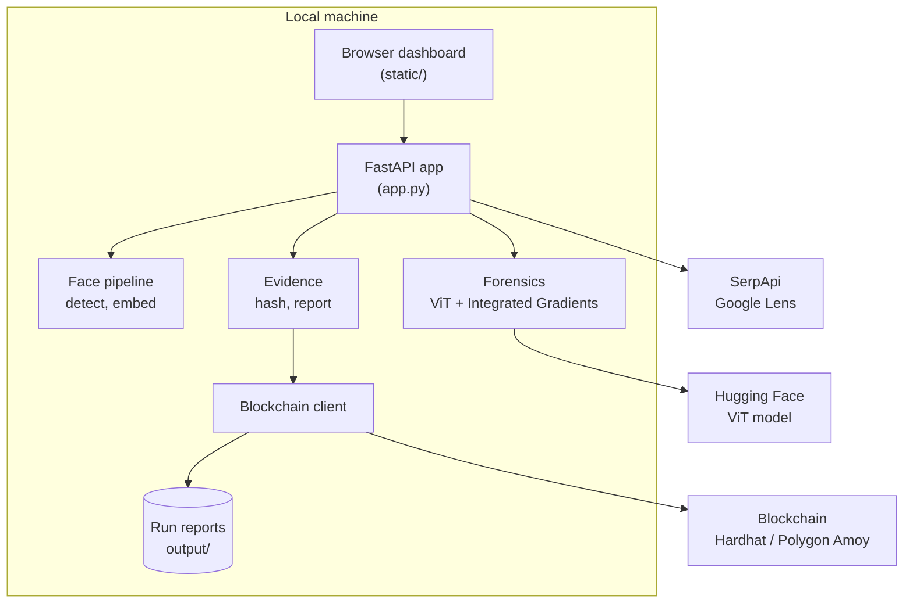
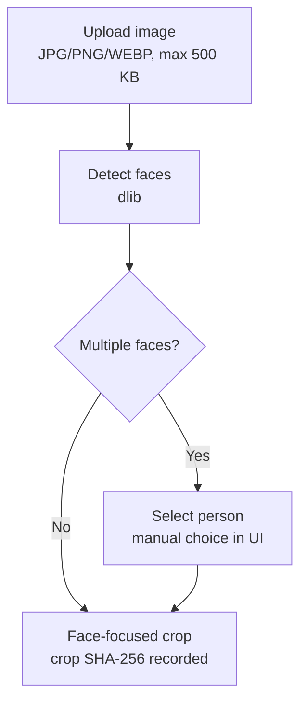
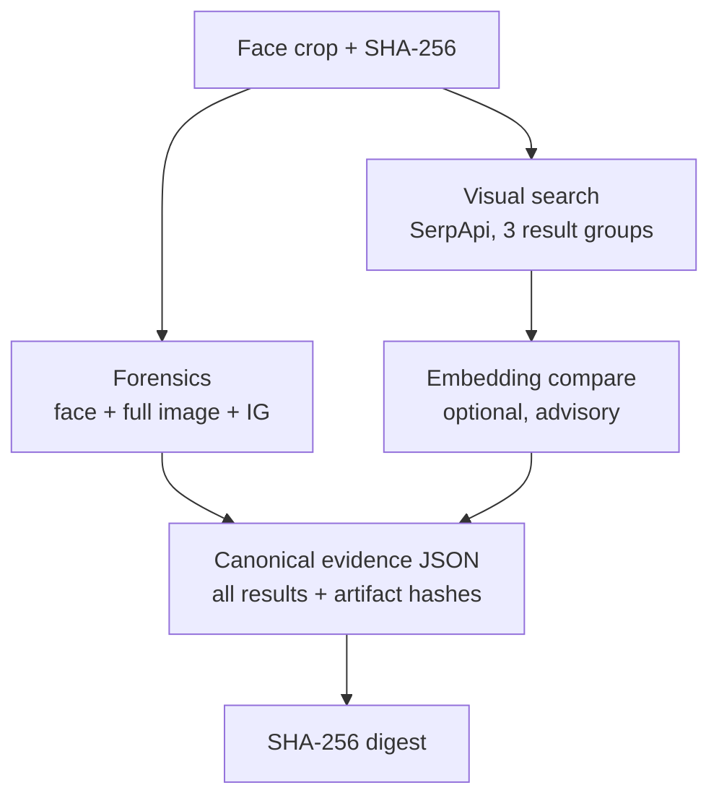
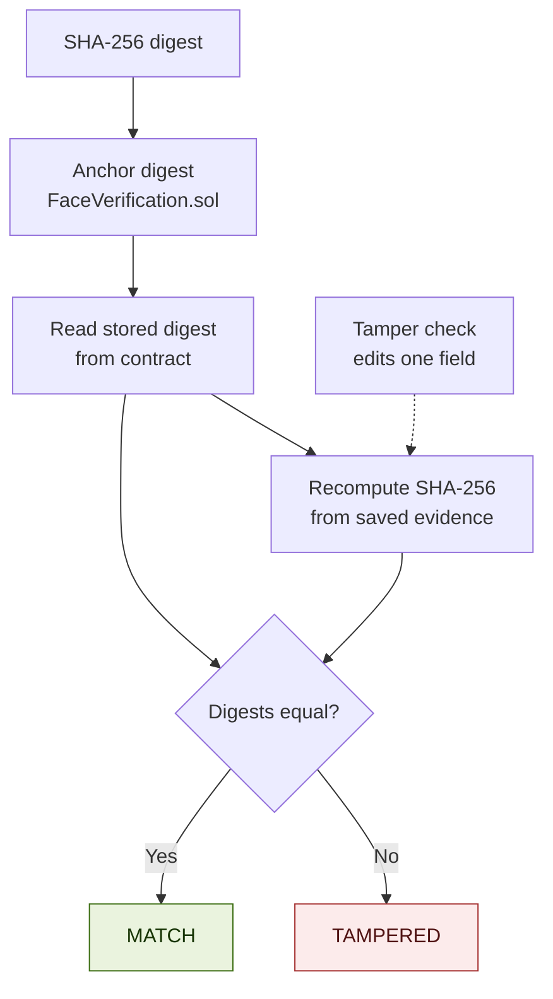

# The Acers — Face Blockchain Verify

> Tamper-evident evidence handling for **consented** images: visual search, advisory face similarity, AI manipulation forensics, and blockchain anchoring in one local dashboard.


> **Important:** The Acers is a proof of concept for consented images and publicly indexed results. It does **not** prove identity, search private accounts, or guarantee that a matching image exists online.

---

## Table of Contents

1. [Overview](#overview)
2. [Features](#features)
3. [Architecture and Flow](#architecture-and-flow)
4. [Tech Stack](#tech-stack)
5. [Project Structure](#project-structure)
6. [Quick Start](#quick-start)
7. [Configuration](#configuration)
8. [Blockchain Setup](#blockchain-setup)
9. [Usage](#usage)
10. [AI Forensics and Explainability](#ai-forensics-and-explainability)
11. [Evidence Record and Verification](#evidence-record-and-verification)
12. [Command-Line Pipeline](#command-line-pipeline)
13. [Testing](#testing)
14. [Demo Flow](#demo-flow)
15. [Troubleshooting](#troubleshooting)
16. [Limitations](#limitations)
17. [Privacy and Ethics](#privacy-and-ethics)
18. [Credits and License](#credits-and-license)

---

## Overview

You upload an authorized photo. The Acers detects faces, lets you pick one person if several are found, runs a live Google Lens search (through SerpApi) on a face-focused crop, optionally compares candidate faces with embeddings, and analyses the image with a pretrained manipulation classifier plus an explainability heatmap.

Everything is bundled into a canonical evidence record, hashed with SHA-256, and anchored on a blockchain. Recomputing the hash later returns **MATCH** if the record is intact or **TAMPERED** if anything changed.

## Features

- Local browser dashboard with full-image preview
- Manual person selection when multiple faces are detected
- Face-focused crop used as the search query
- Live Google Lens search via SerpApi, grouped into **Most Similar**, **Relevant** and **Similar**
- Advisory face-embedding comparison (`face_recognition` / dlib)
- Face authenticity check and full-image manipulation classification (Vision Transformer)
- Integrated Gradients heatmap and overlay
- SHA-256 evidence hashing, including forensic scores and visualization hashes
- Local Hardhat and Polygon Amoy testnet support
- On-chain verification with `MATCH` / `TAMPERED` result and a one-click tamper demo
- Saved JSON evidence reports
- Offline pytest suite

## Architecture and Flow

### System architecture



### 1. Input stage



### 2. Analysis and evidence



### 3. Blockchain verification



## Tech Stack

| Layer | Tools |
|---|---|
| Backend | Python 3.11, FastAPI, Uvicorn |
| Face detection / embeddings | `face_recognition`, dlib |
| Visual search | SerpApi (Google Lens) |
| AI forensics | Hugging Face Transformers, PyTorch, `prithivMLmods/Deep-Fake-Detector-v2-Model` |
| Explainability | Integrated Gradients |
| Blockchain | Solidity, Hardhat, Polygon Amoy |
| Frontend | Static dashboard served by the app (`static/`) |
| Tests | pytest |

## Project Structure

```text
Hackers-Goa-Project/
├── app.py                 # FastAPI app and dashboard API
├── contracts/             # FaceVerification.sol
├── scripts/               # Deployment scripts (deploy.js)
├── pipeline/              # CLI pipeline: main.py, verify.py
├── static/                # Dashboard frontend
├── sample_images/         # Sample inputs for demos
├── tests/                 # Offline pytest suite
├── demo.sh                # Demo helper script
├── hardhat.config.js
├── package.json
├── requirements.txt       # Base Python dependencies
├── requirements-ml.txt    # Optional ML stack (forensics + XAI)
└── .env.example           # Environment template
```

> Runtime reports are written to `output/<timestamp>/`.

## Quick Start

**Requirements:** Python 3.11+, Node.js 18+, npm, a [SerpApi](https://serpapi.com/users/sign_up) key, and an internet connection for live search. `dlib` may need build tools on some systems.

```bash
git clone https://github.com/sandesh362/Hackers-Goa-Project.git
cd Hackers-Goa-Project

# Python environment
python -m venv .venv
source .venv/bin/activate          # Windows PowerShell: .venv\Scripts\Activate.ps1

pip install -r requirements.txt
pip install -r requirements-ml.txt # optional: forensics + explainability

# Node / Hardhat
npm install
npx hardhat compile

# Config
cp .env.example .env               # Windows PowerShell: Copy-Item .env.example .env
```

Start the dashboard:

```bash
uvicorn app:app --reload --port 8000
```

Open <http://127.0.0.1:8000>.

## Configuration

Set values in the dashboard **Settings** panel (saved to local `.env`, secrets masked) or edit `.env` directly.

| Variable | Local Hardhat | Polygon Amoy |
|---|---|---|
| `SERPAPI_KEY` | your key | your key |
| `NETWORK` | `local` | `amoy` |
| `WEB3_RPC_URL` | `http://127.0.0.1:8545` | your Amoy RPC URL |
| `PRIVATE_KEY` | temporary Hardhat key | dedicated **test** wallet key |
| `CONTRACT_ADDRESS` | printed by deploy script | printed by deploy script |
| `MAX_WEB_RESULTS` | `10` | `10` |

> **Never commit `.env` or use a real wallet key.** Testnet credentials only.

## Blockchain Setup

### Local Hardhat

```bash
# Terminal 1 — keep running
npx hardhat node

# Terminal 2
npx hardhat run scripts/deploy.js --network localhost
```

Copy the address printed by the deploy script into your settings. Restarting `npx hardhat node` resets the chain, so redeploy and update the address.

### Polygon Amoy

1. Create a dedicated test wallet.
2. Get test MATIC from a current Amoy faucet.
3. Set an Amoy RPC endpoint in `.env`.
4. Deploy:

   ```bash
   npm run deploy:amoy
   ```

5. Put the deployed address in `CONTRACT_ADDRESS` and set `NETWORK=amoy`.

Transactions can be viewed at `https://amoy.polygonscan.com/tx/<TX_HASH>`.

## Usage

1. Open the dashboard and check **Settings**.
2. Upload a consented image (JPG, JPEG, PNG or WEBP, **max 500 KB**).
3. If several faces are detected, select the intended person.
4. Click **Find top matches**.
5. Review **Most Similar**, **Relevant** and **Similar** results.
6. Review the authenticity, forensics and heatmap panels.
7. Scroll to blockchain verification and check the status.
8. Click **Run tamper check** to demonstrate `TAMPERED`.

## AI Forensics and Explainability

**Model:** `prithivMLmods/Deep-Fake-Detector-v2-Model`, a fine-tuned ViT-base (patch 16) classifier with Realism / Deepfake classes, loaded through Transformers and PyTorch. A specific Hugging Face commit is pinned for repeatable loading. The model downloads on first inference and uses CUDA when available, otherwise CPU.

**Two assessments:**

- **Face authenticity** on the dlib face crop (crops under 64 px per side are skipped), plus a deterministic 0–100 quality heuristic.
- **Image forensics** on the full RGB upload, returning `classification`, `manipulation_score`, `authenticity_score`, model metadata and thresholds.

**Display bands:** ≤ 0.35 likely authentic, ≥ 0.65 potentially manipulated, otherwise inconclusive.

**Explainability:** Integrated Gradients (16 steps, zero baseline) on the manipulated-class score. Positive attribution is saved as a heatmap and blended overlay, served through a run-scoped API route. Their SHA-256 hashes go into the evidence; image data is never stored on-chain.

If the ML stack, model download or explanation step fails, the search and blockchain pipeline still runs and records the analysis as unavailable.

> This is a demonstration classifier, not forensic-grade or independently validated. Scores are not calibrated probabilities, and heatmaps show regions that influenced the model, not confirmed altered pixels.

## Evidence Record and Verification

The canonical evidence record includes the crop hash, matched URL, source domain, snippet, similarity value (when available), timestamp, face and full-image forensic results, thresholds, model metadata, and explanation artifact hashes. Changing any hashed field changes the digest.

```json
{
  "image_forensics": {
    "classification": "inconclusive",
    "manipulation_score": 0.51,
    "authenticity_score": 0.49,
    "explainability": {
      "method": "Integrated Gradients",
      "heatmap_available": true,
      "overlay_available": true
    }
  },
  "evidence_hash": "SHA-256 of canonical evidence"
}
```

Verification steps: build record → compute SHA-256 → store in `FaceVerification.sol` → record transaction → read back → recompute → compare. The dashboard shows status, contract address, transaction hash, block number, evidence SHA-256 and network.

The API response at `/api/runs/{id}` includes `report.image_forensics`.

## Command-Line Pipeline

```bash
python pipeline/main.py --image "path/to/consented-photo.jpg"

# if your configuration needs an image URL
python pipeline/main.py --image "path/to/consented-photo.jpg" --image-url "https://example.com/image.jpg"
```

Reports are saved to `output/<timestamp>/report_<timestamp>.json`.

```bash
# Verify a report
python pipeline/verify.py --report "output/<timestamp>/report_<timestamp>.json"

# Simulate tampering (expected: TAMPERED)
python pipeline/verify.py --report "output/<timestamp>/report_<timestamp>.json" --simulate-tamper
```

## Testing

```bash
pytest -q
```

The suite runs offline and does not call SerpApi or a live chain.

## Demo Flow

1. Start the Hardhat node
2. Deploy `FaceVerification.sol`
3. Start the dashboard
4. Show the masked Settings
5. Upload a consented image and select a face if needed
6. Run the visual search and show the three result groups
7. Show authenticity, forensics and the Integrated Gradients heatmap
8. Show the Evidence SHA-256 and blockchain transaction
9. Show **MATCH**
10. Click **Run tamper check** and show **TAMPERED**

## Troubleshooting

| Problem | Fix |
|---|---|
| Dashboard won't start | Activate the virtualenv, then `uvicorn app:app --reload --port 8000` |
| Hardhat connection fails | Make sure `npx hardhat node` is running and `WEB3_RPC_URL=http://127.0.0.1:8545` |
| Contract not found | Redeploy after restarting Hardhat and update `CONTRACT_ADDRESS` |
| Upload rejected | Use JPG/JPEG/PNG/WEBP at 500 KB or smaller |
| No Google Lens result | A public match may not exist; the app never fabricates results |
| Forensics unavailable | Install `requirements-ml.txt` and check Hugging Face access |
| Amoy transaction fails | Check RPC URL, test key, test MATIC balance, contract address and network |

## Limitations

- **Images:** low-resolution, compressed, blurred, dark or occluded faces reduce detection and matching quality.
- **Search:** results depend on what Google Lens and SerpApi return at that moment. No results does not mean no image exists.
- **Face comparison:** advisory only. The commonly cited `0.6` distance is a starting reference, not a universal threshold. False positives and negatives occur.
- **Forensics:** the classifier is not validated for forensic use and can fail on compression, edits or unfamiliar generators.
- **Blockchain:** anchoring proves the record was not altered, not that its contents are true. `MATCH` does not mean a person was identified.
- **Operations:** local Hardhat state is temporary, Amoy can be unreliable, and third-party APIs may change.

## Privacy and Ethics

Use only images you own or have explicit permission to process. Do not use this project to track people, profile individuals, identify strangers, search private accounts, or bypass access controls. Public availability does not make personal content fair game for identification. Human review and proper authorization are required.

> **The Acers is intended for authorized, consented and responsible use only. It is not a production identity-verification system.**

## Credits and License

- Forked from [SkaaBroach853/Hackers-Goa-Project](https://github.com/SkaaBroach853/Hackers-Goa-Project)
- Model: [`prithivMLmods/Deep-Fake-Detector-v2-Model`](https://huggingface.co/prithivMLmods/Deep-Fake-Detector-v2-Model)
- Visual search: [SerpApi](https://serpapi.com/)

This is a hackathon proof of concept. No license file is currently in the repository, so add one (for example MIT) before distributing, and review the terms of SerpApi, Hugging Face and the model before any deployment beyond demos.
